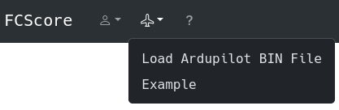
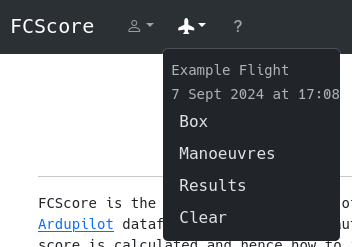

---
hide:
  - toc
---

# Scoring a Flight

In order to score a flight you need to input your recorded flight data, defined the aerobatic box you flew in and identify the manoeuvres. Tools for analysing flights are accessed through the Flight menu in the top navbar.

  

1. [Load Flight Data](load_flight_data.md)

2. [Define the Box](box_definition.md)

3. [Identify the Manoeuvres](manoeuvre_segmentation.md)